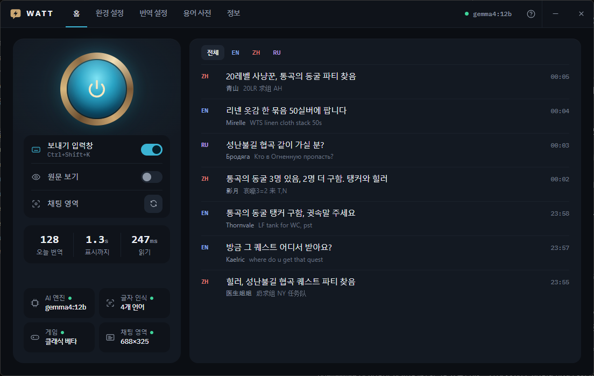

<p align="center"></p>
<h1 align="center">WATT</h1>
<p align="center">월드 오브 워크래프트 클래식 채팅 실시간 통역 · Real-time chat interpreter for WoW Classic</p>

<p align="center"></p>

외국어 채팅(영어·중국어·러시아어)을 읽어 게임 위에 한국어로 띄우고, 한국어로 쓴 말은 상대 언어로 바꿔 줍니다.
번역은 **내 PC 안의 AI**(Ollama + Gemma 4)가 합니다.

## 다운로드
[**Releases**](../../releases)에서 받으세요.

| 종류 | 파일 | 쓰는 법 |
|---|---|---|
| **포터블**(기본) | `WATT-Portable-<버전>.zip` | 압축을 풀고 `WATT\WATT.exe` 실행. 설정·기록은 그 폴더 안 `data\` — 폴더째 옮겨도 됩니다 |
| 설치판 | `WATT-Setup-<버전>.exe` | 실행하면 관리자 권한 없이 내 계정에만 설치. 설정·기록은 `%LOCALAPPDATA%\WATT` |

새 기능은 포터블에 먼저 나오고, 설치판은 필요할 때 맞춰 냅니다. 둘 다 앱 안에서 자기 종류로 업데이트됩니다.

> 코드 서명이 아직 없어 처음 실행할 때 "Windows의 PC 보호" 창이 뜰 수 있습니다. **추가 정보 → 실행**을 누르세요.

## 필요한 것
| 항목 | 권장 |
|---|---|
| Windows | 10 (1809 이상) / 11, 64비트 |
| 그래픽카드 | VRAM 8GB 이상 (NVIDIA 권장) |
| 게임 | 창 모드(최대화) 또는 전체 창 모드 |

AI 실행기(Ollama), 번역 모델, 글자 인식 언어 팩은 앱의 **환경 설정**에서 버튼으로 설치합니다.
번역 모델 Gemma 4 는 Ollama 모델 저장소에서 받으며 Google [Gemma 이용 약관](https://ai.google.dev/gemma/terms)을 따릅니다.

## 쓰는 법
1. **환경 설정** 7단계를 차례로 끝냅니다.
2. 게임을 켜고 홈의 **전원 버튼**을 누르면 게임 위에 통역 창이 뜹니다.
3. 보낼 말은 **Ctrl+Shift+K**(게임 중에는 Ctrl+Enter) → 한국어 입력 → Enter → 게임 채팅창에 Ctrl+V.

채팅창을 잘 읽게 하는 게임 설정은 [docs/setup-guide.md](docs/setup-guide.md)에 있습니다.

## 약속
- **PC 안에서만 번역** — 채팅 내용을 인터넷으로 보내지 않습니다.
- **화면만 읽음** — 채팅창을 캡처해 글자를 읽을 뿐, 게임 파일·메모리를 건드리지 않습니다.
- **자동 입력 없음** — 번역문은 클립보드에 두거나 입력칸에 넣기까지만 합니다. 보내기는 직접.
- **보낼 때는 직접 고를 때만** — 환경 설정 → 채팅 영역의 **인식 오류 신고**를 누르고 미리 보기를 확인했을 때만, 게임 화면 1장과
  영역 정보(찾은 영역 · 지정한 영역 · 창 크기 · 앱 버전 · 무작위 설치 ID)를 WATT 서버([server/](server/))로 보냅니다.
  24시간에 1번, 화면에 다른 사람 이름이 보일 수 있어 공개하지 않고 **30일 뒤 지웁니다**. 지워 달라는 요청은 GitHub 이슈로.

## AI 글자 인식(권장)
글자는 Windows OCR 로 읽고, **번역 설정 → AI 글자 인식**(또는 환경 설정의 권장 단계)에서 언어를 켜면 PaddleOCR 모델(Apache-2.0)로 함께 읽습니다.
권장은 한국어 · 중국어 · 러시아어 — 정답 표본 227 메시지에서 Windows OCR 만으로는 외국어 메시지 찾음 97.4% · 이름 91.9%, 켜면 99.6% · 97.8%.
중국어 모델은 작은 글꼴의 영어도 더 잘 읽습니다. 스페인어 · 독일어 · 프랑스어 · 포르투갈어가 많으면 '유럽어'도 켭니다.
켠 언어의 모델만 받습니다 — 실행 엔진 onnxruntime-directml(MIT, PyPI) 25MB + 공통 10MB + 한국어 13MB · 중국어 21MB · 러시아어 8MB ·
유럽어 8MB(ModelScope). 받은 파일은 확인값(SHA256)이 맞을 때만 씁니다. 기본은 CPU(게임 VRAM 을 쓰지 않음), GPU 를 켜면 VRAM 1–2GB 를 더 씁니다.
그 언어가 화면에 보일 때만 모델을 돌립니다.

## 업데이트
켤 때 새 버전을 확인하고, 바뀐 파일만(보통 수 MB) 뒤에서 받아 둔 뒤 **다시 시작할지** 묻습니다. 나중에를 누르면 다음에 켤 때 바뀝니다.
설치판 · 포터블 모두 설치 프로그램 없이 바꾸고, 실패하면 옛 파일로 되돌립니다.
번역 설정 → 업데이트에서 끌 수 있습니다(확인할 때 GitHub 에 IP 가 남습니다).

## 삭제
앱의 **환경 설정**에서 하나씩 지울 수 있습니다 — 모델·글꼴 애드온은 휴지통, OCR 언어 팩(중국어·러시아어)은 ×, Ollama 는 "제거".
AI 글자 인식 파일은 번역 설정 → AI 글자 인식의 휴지통.

포터블은 앱 안에서 지울 것을 지운 뒤 폴더를 지우면 끝입니다.
설치판은 "설정 → 앱"에서 제거합니다. 제거할 때 하나씩 묻습니다.
- WATT 로 받은 AI 모델 · 게임 폴더의 글꼴 애드온 · WATT 설정과 기록(채팅 기록 포함)

**WATT 가 설치한 것만 지웁니다.** 설치할 때 원래 있던 Ollama · 모델 · OCR 언어 팩은 기록하지 않으므로 그대로 남습니다.
정보 화면의 **설치한 것 정리**는 WATT 가 설치한 모델 · OCR 언어 팩 · 애드온 · Ollama 를 한 번에 되돌립니다(포터블은 이걸 누른 뒤 폴더를 지우면 끝).

| | 설치할 때 | 지울 때 |
|---|---|---|
| Python | 설치하지 않음 — WATT 폴더 안에 들어 있음 | 폴더와 함께 사라짐 |
| .NET Framework · WebView2 | Windows 에 원래 있는 것을 씀 | 손대지 않음 |
| Ollama · 모델 · OCR 언어 팩 | 없을 때만 설치하고 기록 | 기록한 것만 지움 |
| AI 글자 인식(모델 · 실행 엔진) | 켠 언어만 WATT 데이터 폴더의 `ai` 에 받음 | 물어보고 지움 |
| 설정 · 기록 · 창 캐시 | WATT 데이터 폴더 | 물어보고 지움(포터블은 폴더와 함께) |

## 로드맵
다음 단계(0.2.0 인식 안정판 · 0.3.0 함께 고치기 · 1.0.0 정식판)와 버전 규칙: [docs/ROADMAP.md](docs/ROADMAP.md)

## 개발
```
pip install pywebview numpy pyinstaller winrt-runtime winrt-Windows.Media.Ocr winrt-Windows.Graphics.Imaging ^
  winrt-Windows.Globalization winrt-Windows.Storage.Streams winrt-Windows.Foundation winrt-Windows.Foundation.Collections
python -m watt                # 런처
python -m eval.quick_translate   # 번역 평가(60문장)
python tools/build.py               # 포터블 zip (기본)
python tools/build.py --installer   # + 설치 프로그램(필요할 때만)
```
| 폴더 | 내용 |
|---|---|
| `watt/` | 런처(pywebview), 화면 캡처·Windows OCR · AI 글자 인식(`aiocr` · `aipack`), 채팅 영역 찾기, 환경 점검·설치 |
| `watt/ui/` | 런처 화면(HTML/CSS/JS) |
| `translator/` | 통역 창(live), 보내기 입력창(outgoing), 번역 프롬프트, 용어 사전(`wow_terms.json`) |
| `addon/ChatFontCJK/` | 중국어·러시아어 채팅이 □로 깨지지 않게 하는 게임 글꼴 애드온 |
| `eval/` | 번역 평가 세트 |
| `tools/` | 빌드, 아이콘, 기록 분석 |

버전은 `0.1.N` — 안건(추가·수정·변경·삭제) 하나마다 N 을 올리고, [이슈](../../issues)와 [릴리스](../../releases)로 남깁니다.

자세한 빌드 방법: [docs/build.md](docs/build.md) · 용어 사전 고치기: [docs/setup-guide.md](docs/setup-guide.md#용어-사전)

## 라이선스
코드는 [MIT](LICENSE). 함께 배포하는 글꼴(IBM Plex, Sarasa Gothic)은 SIL OFL 1.1.

World of Warcraft는 Blizzard Entertainment의 상표입니다. WATT는 Blizzard와 관련 없는 비공식 도구입니다.
